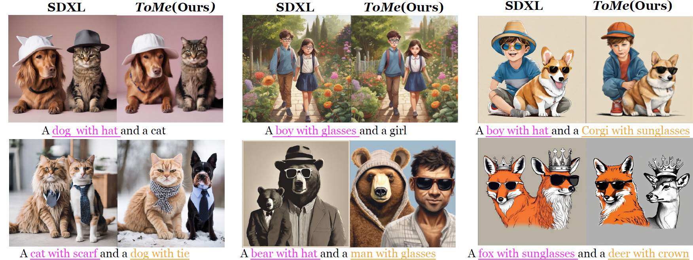
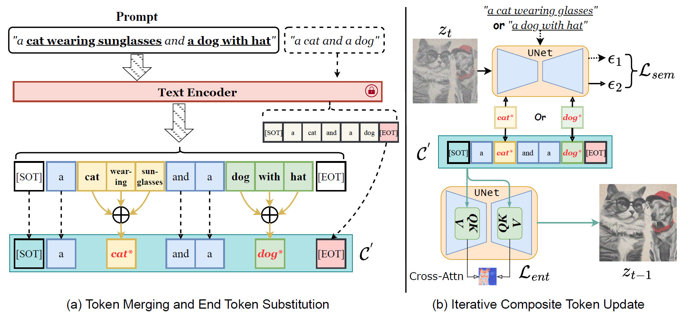

# 🌟 [NeurIPS 2024] Token Merging for Training-Free Semantic Binding in Text-to-Image Synthesis



## 📑 Introduction

> **Token Merging for Training-Free Semantic Binding in Text-to-Image Synthesis**
>
> [Taihang Hu](https://hutaihang.github.io), [Linxuan Li](https://github.com/Potato-lover), [Joost van de Weijer](http://lamp.cvc.uab.es/), [Hongcheng Gao](https://gao-hongcheng.github.io/), [Fahad Khan](https://sites.google.com/view/fahadkhans/home), [Jian Yang](https://scholar.google.com.hk/citations?user=6CIDtZQAAAAJ&hl=en), [Ming-Ming Cheng](https://mmcheng.net/), [Kai Wang](https://wangkai930418.github.io/), [Yaxing Wang](https://yaxingwang.netlify.app/author/yaxing-wang/)
>
> 📚[arXiv](https://arxiv.org/abs/2411.07132)

This paper defines **semantic binding** as the task of associating an object with its attribute (attribute binding) or linking it to related sub-objects (object binding). We propose a novel method called **Token Merging (ToMe)**, which enhances semantic binding by aggregating relevant tokens into a single composite token, aligning the object, its attributes, and sub-objects in the same cross-attention map.



For technical details, please refer to our paper.

## 🚀 Usage

1. **Environment Setup**

   **Create and activate the Conda virtual environment:**

   ```bash
   conda env create -f environment.yaml
   conda activate tome
   ```
   Alternatively, install dependencies via `pip`:
    ```bash
    pip install -r requirements.txt
    ```

   Additionally, download the SpaCy model for syntax parsing:

   ```bash
   python -m spacy download en_core_web_trf
   ```

2. **Configure Parameters**

   Modify the `configs/demo_config.py` file to adjust runtime parameters as needed. This file includes two example configuration classes: `RunConfig1` for object binding and `RunConfig2` for attribute binding. Key parameters are as follows:

   - `prompt`: Text prompt for guiding image generation.
   - `model_path`: Path to the Stable Diffusion model; set to `None` to download the pretrained model automatically.
   - `use_nlp`: Whether to use an NLP model for token parsing.
   - `token_indices`: Indices of tokens to merge.
   - `prompt_anchor`: Split text prompt.
   - `prompt_merged`: Text prompt after token merging.
   - For further parameter details, please refer to the comments in the configuration file and our paper.

3. **Run the Example**

   Execute the main script `run_demo.py`:

   ```bash
   python run_demo.py
   ```

   The generated images will be saved in the `demo` directory.

## 📸 Example Outputs

If everything is set up correctly, `RunConfig1` and `RunConfig2` should produce the left and right images below, respectively:


## ⚠️ Notes

- **Custom Configurations**: To use custom text prompts and parameters, add a new configuration class in `configs/demo_config.py` and make necessary adjustments in `run_demo.py`.
- **Parameter Sensitivity**: This method inherits the sensitivity of inference-based optimization techniques, meaning that the generated results are highly dependent on hyperparameter settings. Careful tuning may be required to achieve optimal results.
- **NLP Models**: When using NLP models like SpaCy for token parsing, ensure the correct language model is installed.

## 🙏 Acknowledgments

This project builds upon valuable work and resources from the following repositories:

- [Attend-and-Excite](https://github.com/yuval-alaluf/Attend-and-Excite) 
- [Linguistic Binding in Diffusion Models](https://github.com/RoyiRa/Linguistic-Binding-in-Diffusion-Models)
- [🤗 Diffusers](https://github.com/huggingface/diffusers) 

We extend our sincere thanks to the creators of these projects for their contributions to the field and for making their code available. 🙌

